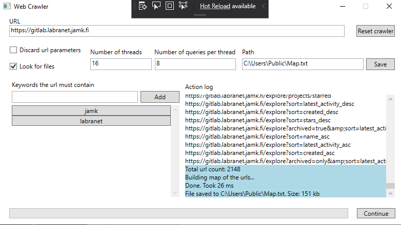

# Web crawler

This is a project I made for a course called "Concurrent programming".  
More details can be found from the report below

## [Report](./REPORT.md)



### [Example output](./Map.txt)

```
- https://student.labranet.jamk.fi
    - wp-content
        - themes
            - blankslate
                - style.css
        - plugins
            - nextend-smart-slider3-pro
                - library
                    - media
                        - smartslider.min.css?1536570312
                        - dist
                            - smartslider-frontend.min.js?1536570312
                            - particles.min.js?1536570312
                        - plugins
                            - type
                                - block
                                    - block
                                        - dist
                                            - smartslider-block-type-frontend.min.js?1536570312
                - nextend
                    - media
                        - dist
                            - n2-j.min.js?1536570312
                            - nextend-gsap.min.js?1536570312
                            - nextend-frontend.min.js?1536570312
                            - nextend-webfontloader.min.js?1536570312
```
